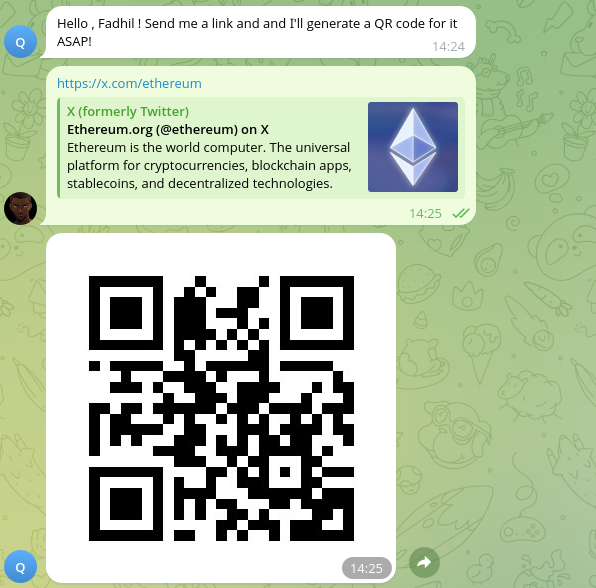

---

# Telegram QR Code Bot

A Telegram bot that generates QR codes from URLs using **Telegraf** and **QRCode** libraries.



## Features

- `/start` command sends a welcome message.
- Generates QR codes from URLs and sends them back.

## Setup

1. **Clone the repo**:
    ```bash
    git clone git@github.com:FadhilMulinya/qr-Code.git
    cd qr-Code
    ```

2. **Install dependencies**:
    ```bash
    pnpm install
    ```

3. **Set up `.env`**:
    ```bash
    cp .env.example .env
    ```
    Add your **BOT_TOKEN**.

4. **Deploy to Vercel**:
    ```bash
    npm install -g vercel
    vercel
    ```

5. **Set the webhook**:
    ```bash
    curl -F "url=https://your-app-name.vercel.app" https://api.telegram.org/bot<your_bot_token>/setWebhook
    ```

## How to Use

- **Start**: Type `/start` to get a welcome message.
- **Generate QR**: Send any URL for a QR code.

## License

MIT License.

---

